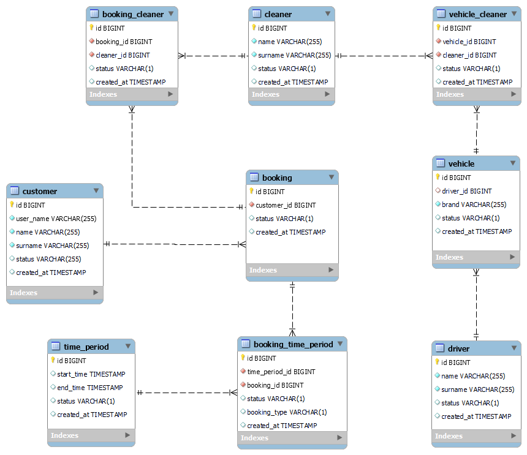

# Cleaner Booking Rest Api

Cleaner Booking rest api that includes cleaner and booking operations using spring boot and mySql DB.


## Prerequisites
- Java 11
- [Maven](https://maven.apache.org/guides/index.html)
- [MySql DB](https://www.mysql.com/downloads/)


##  Build and Run application

### Setup database tables
- Run sql scripts in the [create_table.sql](src/main/resources/sql/create_table.sql) to create tables.
- To add sample data [insert_data.sql](src/main/resources/sql/insert_data.sql) can be used.

###  Build and Run application
-   _GOTO >_ **~/absolute-path-to-directory/cleaner-booking-api**  
and try below command in terminal
    > **```mvn spring-boot:run```** it will run application as spring boot application

    or
    > **```mvn clean install```** it will build application and create **jar** file under target directory

    Run jar file from below path with given command
    > **```java -jar ~/path-to-recipe-service/target/cleaner-booking-api-0.0.1-SNAPSHOT.jar```**

### Model class
   Below are the model classes to perform database operations.  
 
```
    public class Booking {
        private Long id;
        private Long customerId;
    }
    
    public class Cleaner {
        private Long id;
        private String name;
        private String surname;
    }
    
    public interface CleanerAvailableTime {
        Long getId();
        String getName();   
        String getSurName();   
        LocalDateTime getStartTime();  
        LocalDateTime getEndTime();
    }

    public class BookingCleaner {
        private Long id;
        private Long bookingId;  
        private Long cleanerId;  
    }
    
    public class BookingTimePeriod {
        private Long id;
        private Long bookingId;
        private Long timePeriodId;
        private Status status;
        private BookingType bookingType;
    }
    
    public class TimePeriod {
        private Long id;
        private LocalDateTime startTime;
        private LocalDateTime endTime;
        private String status;
    }
   ```

### Endpoints

#### Swagger and root

|HTTP Method|URL|Description|
|---|---|---|
|`GET`|http://localhost:8080/ | Root page |
|`GET`|http://localhost:8080/swagger-ui/index.html | Swagger UI page |
|`GET`|http://localhost:8080/actuator | Actuator page |

#### Booking Service

|HTTP Method|URL|Description|
|---|---|---|
|`POST`|http://localhost:8080/api/v1/booking | Create new Booking |
|`PATCH`|http://localhost:8080/api/v1/booking/{id} | Update Booking by ID |
|`GET`|http://localhost:8080/api/v1/booking/{id} | Get Booking by ID |

#### Cleaner Service

|HTTP Method|URL|Description|
|---|---|---|
|`GET`|http://localhost:8080/api/v1/cleaner/available?date={date}&startTime={startTime}&duration={duration}&numberOfCleaner={numberOfCleaner} | Get available cleaner list |

### Database ER Diagram

The ER Diagram of Database that is designed by requirements 

